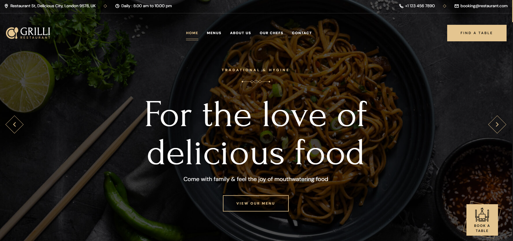

# GRILLI Restaurant Website

Welcome to **GRILLI**, a stunning and modern restaurant website designed to showcase an elegant user interface. This project highlights a visually appealing front-end experience, presenting essential restaurant details such as the menu, customer reviews, and operating hours.

## Features

- **Home Page**: A welcoming landing page with a clean layout and engaging visuals to captivate visitors.
- **Menu Section**: Displays the restaurant's offerings in an organized and appealing format.
- **Customer Reviews**: A dedicated section for customer feedback to build trust and credibility.
- **Operating Hours**: Clear display of the restaurant's working hours for customer convenience.
- **Responsive Design**: Optimized for a seamless experience across various devices.

## Technologies Used

- **HTML**: Structuring the web pages.
- **CSS**: Styling the website with modern design techniques.
- **JavaScript**: Adding interactivity and enhancing user experience.

